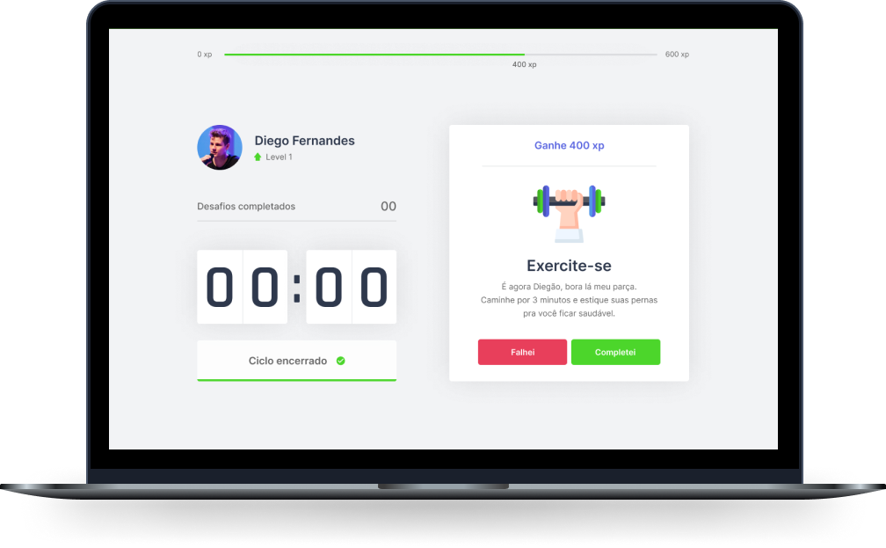

<h1 align="center">
  
  <br />
  <a href="https://github.com/jose-bone/moveit/blob/master/LICENSE.md">
    
  </a>
  <a href="https://github.com/jose-bone/moveit/network">
    
  </a>
  <a href="https://github.com/jose-bone/moveit-nlw4/stargazers">
    
  </a>
</h1>
<p align="center">
  <a href="#page_facing_up-descrição">Descrição</a>&nbsp;&nbsp;&nbsp;|&nbsp;&nbsp;&nbsp;
  <a href="#art-Layout">Layout</a>&nbsp;&nbsp;&nbsp;|&nbsp;&nbsp;&nbsp;
  <a href="#-tecnologias">Tecnologias</a>&nbsp;&nbsp;&nbsp;|&nbsp;&nbsp;&nbsp;
  <a href="#closed_book-instalação">Instalação</a>&nbsp;&nbsp;&nbsp;|&nbsp;&nbsp;&nbsp;
  <a href="#man-Autor">Autor</a>&nbsp;&nbsp;&nbsp;|&nbsp;&nbsp;&nbsp;
  <a href="#memo-Licença">Licença</a>
</p>

<p align="center">
  
</p>

## 📄 Descrição

O Move.it é um projeto criado pela Rocketseat para ser uma plataforma que combina a técnica do Pomodoro, que consiste em ciclos alternados de foco e descanso, com exercícios de bem-estar para quem passa muitas horas em frente ao computador, que pode ser prejudicial à sua saúde quando você não faz exercícios ou descansa!

## 🎨 Layout

Você pode acessar o Layout pelo <a href="https://www.figma.com">Figma</a> através desse <a href="https://www.figma.com/file/ge20pu3ofMOKoliUyKx1Nl/Move.it-1.0"> link</a>.

## 🛠 Tecnologias

Este projeto foi desenvolvido com as seguintes tecnologias:

- [Next.js](https://nextjs.org/)
- [React.js](https://pt-br.reactjs.org/)
- [TypeScript](https://www.typescriptlang.org/)

## 📕 Instalação

### Pré-requisitos

Antes de começar, você vai precisar ter instalado em sua máquina as seguintes ferramentas:
[Git](https://git-scm.com), [Node.js](https://nodejs.org/en/), Além disto é bom ter um editor para trabalhar com o código como [VSCode](https://code.visualstudio.com/)

```bash
# Clone este repositório.
$ git clone https://github.com/jose-bone/moveit.git

# Vá para a pasta moveit-nlw4
$ cd moveit

# Instale as dependências
$ npm install

# Execute aplicação
$ npm run dev

# O app vai está rodando na porta 3000 - acesse <http://localhost:3000>
```

## 📝 Autor

<a href="https://github.com/jose-bone/">
 
 <br />
 <sub><b>José Boné</b></sub>
</a>

Feito com ❤️ por José Boné 👋👋 🚀

## 📝 Licença

Copyright © 2021 [José Boné](https://github.com/jose-bone).<br />
This project is [MIT](./LICENSE.md) licensed.
